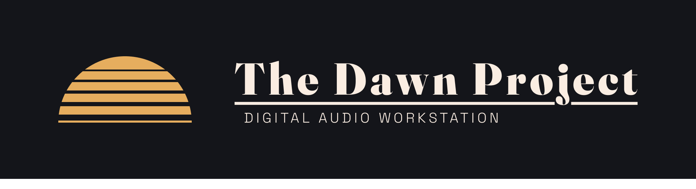

A browser-based digital audio workstation (DAW), built with Next.js and
[Tone.js](https://tonejs.github.io/).

It supports both MIDI and audio production: recording and editing MIDI
performances with a sampled piano or drum kit, importing/dragging in audio
clips, arranging multiple clips per track on a timeline, and shaping each
channel with an insert-effects chain — all in the browser.

## Features

- **Two channel types, Ableton-style** — each track is created as either a
  **MIDI** channel (piano or drum kit instrument, or no instrument) or an
  **audio** channel (for imported audio clips). Audio channels can't load a
  MIDI instrument; both types can use the full audio effects chain.
- **Multi-clip timeline** — every track can hold any number of clips,
  positioned and resized independently along the timeline: drag to move,
  drag the right edge to trim/resize, double-click to open the piano-roll
  editor (MIDI clips), right-click for a context menu (delete, copy, paste,
  export). Tracks can be left empty.
- **Reaper-style FX window** — an **FX** button on each channel opens a
  floating window listing that channel's instrument (MIDI channels only)
  and its audio effects chain, instead of cluttering the channel strip with
  toggle buttons. Available effects: **EQ Three**, **Compressor**,
  **Delay**, and **Reverb**, each with live, draggable parameter knobs.
- **Piano instrument** — a sampled grand piano (Salamander Grand Piano,
  the same sample set used in Tone.js's own examples), playable with the
  mouse/touch, your computer keyboard (Ableton-style Z/Q row mapping), or
  a connected MIDI controller via the Web MIDI API.
- **Drum kit instrument** — a sample-based drum kit playable from pads or
  a MIDI controller.
- **Scale-aware input** — an optional scale/root selector highlights and
  constrains playable notes on the piano and piano-roll editor.
- **Multi-channel recording** — each channel arms independently and
  records your performance as a new MIDI clip.
- **Audio import** — drag an audio file onto a track (or use the context
  menu) to add it as a clip, with a rendered waveform preview.
- **MIDI import/export** — load a `.mid` file into a channel, or export a
  single clip or an entire channel's MIDI as a standard `.mid` file.
- **Copy/paste clips** — copy a clip and paste it elsewhere on the same or
  a different track, at the playhead or at a specific bar.
- **Ableton-style playhead marker** — click (or drag) anywhere on the
  ruler to set the playhead position; Play (button or Space bar) always
  starts from that marker, whether you're resuming after Stop or Pause.
  The selected clip can also be deleted with the **Delete**/**Backspace**
  key.
- **Channel strip** — every channel has a pan knob, a volume knob, and a
  live level meter with peak hold.
- **Custom context menus** — right-clicking a clip, a track lane, or a
  track header opens the app's own context menu; the browser's native
  right-click menu is suppressed throughout.

## Getting started

```bash
npm install
npm run dev
```

Open [http://localhost:3000](http://localhost:3000). Add a MIDI or audio
track, click a channel to arm it, then hit record and play the on-screen
piano/drum pads (or your MIDI keyboard) to capture a take — or drag in an
audio file to add an audio clip.

## Stack

- [Next.js](https://nextjs.org) (App Router, TypeScript, Tailwind CSS)
- [Tone.js](https://tonejs.github.io/) for the Web Audio engine, transport,
  instruments, and effects
- [@tonejs/midi](https://github.com/Tonejs/Midi) for reading/writing
  standard MIDI files
