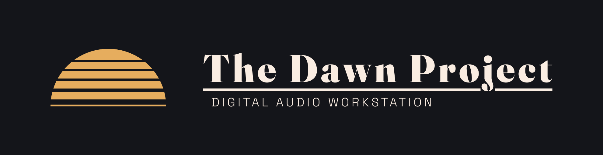
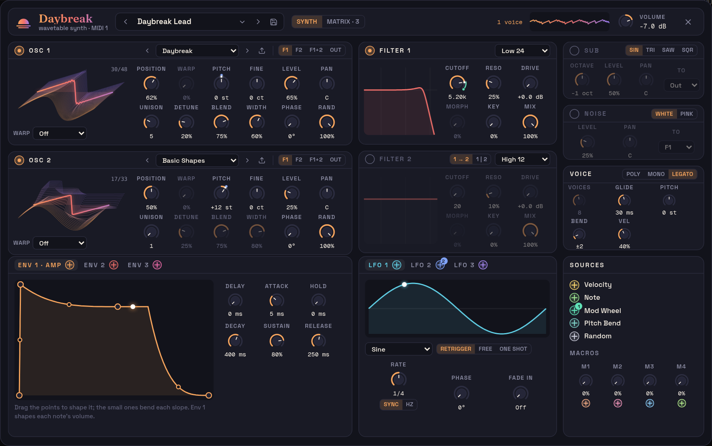
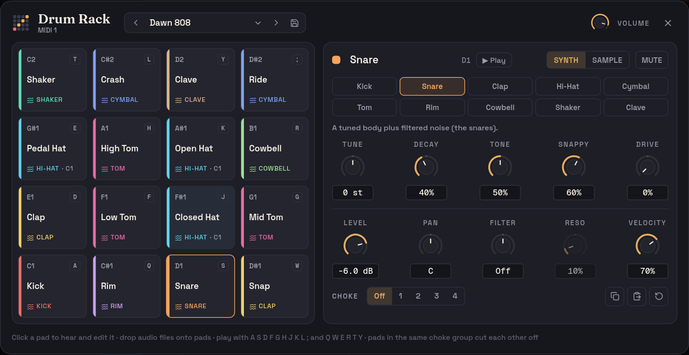

**The Dawn Project** is a digital audio workstation (DAW) that runs entirely
in the browser. You can record and edit MIDI and audio, arrange clips on a
timeline, play three built-in instruments, and mix with 18 studio effects.
Projects are saved to a folder on your computer. Nothing has to be installed
and no account is needed: the sound is made on your machine with the Web
Audio API.

It's built with [Next.js](https://nextjs.org) and
[Tone.js](https://tonejs.github.io/), and its workflow borrows from Ableton
Live and Reaper.

## Contents

- [What it can do](#what-it-can-do)
- [Instruments](#instruments)
- [Daybreak, the synth](#daybreak-the-synth)
- [The Drum Rack](#the-drum-rack)
- [Effects (plugins)](#effects-plugins)
- [Getting started](#getting-started)
- [User guide](#user-guide)
- [Keyboard shortcuts](#keyboard-shortcuts)
- [How it works](#how-it-works)
- [Development](#development)
- [License and credits](#license-and-credits)

## What it can do

- **Templates.** Start from Guitar Demo, Beat, Voice + Guitar or an empty
  project, each set up and ready to play or record.
- **Grooves.** 60 drum patterns in 12 genres (intro, verse, chorus, fill,
  ending) to drag onto a track and play over.
- **MIDI and audio tracks.** Add as many tracks as you like. Each holds any
  number of clips that you move, trim, loop, split and duplicate on the
  timeline.
- **Recording.** Record MIDI from the computer keyboard, the on-screen piano
  or drum pads, or a MIDI controller. Record audio from a microphone or an
  audio interface, with a count-in and a metronome. Each clip is drawn on
  its track while you record it.
- **Arrangement loop**, like Ableton's: a loop brace under the ruler you
  draw, drag and resize, Ctrl+L to loop the selected clips, start and length
  fields, and the arrow keys to move it. It stays on its bars when the tempo
  changes and is saved with the project.
- **Piano roll** to draw, select, move, quantize and adjust the velocity of
  notes.
- **Three instruments:** a sampled grand piano, a 16-pad Drum Rack (modeled
  drum-machine voices or your own samples), and Daybreak, a wavetable synth
  with a modulation matrix.
- **18 effects**, most with their own full-size window, graphs and meters,
  plus presets.
- **Sidechain.** Compressors, gates and multiband dynamics can listen to
  another track (for example, the kick ducking the bass).
- **Send/return buses** and a **master bus**, each with their own effects.
- **Group tracks** (like Ableton's groups or Reaper's folders), and
  **track-to-track routing**: send a track's audio through another track.
- **Folding.** Fold any track, or all of them, to a short row so more fit on
  screen.
- **Automation** of volume, pan and any effect knob.
- **Delay compensation.** Effects that add latency (lookahead, oversampling,
  amp models) are compensated so every track stays in time, both when you
  play and when you export.
- **Undo/redo** for every edit, kept with the project.
- **Projects on your computer.** New, Open, Save and Save As, with recent
  projects. A project is a folder holding the song, its audio files and its
  undo history, or a single `.dawnproject` file.
- **Export** the mix or one file per track (stems) as WAV or MP3, the whole
  song or just the loop, and clips or tracks as `.mid` files.
- **Import** audio files (by drag and drop or the file picker) and `.mid`
  files.

## Instruments

A MIDI track plays one instrument, which you choose in its FX rack.

| Instrument | What it is |
| --- | --- |
| **Piano** | A sampled acoustic grand, the Salamander Grand Piano (a Yamaha C5). |
| **Drums (Drum Rack)** | 16 pads, each a modeled drum voice (kick, snare, clap, hi-hat, cymbal, tom, rim, cowbell, shaker, clave) or a sample you drop in, with its own tune, decay, tone, drive, filter, level, pan and choke group. Eight factory kits (808, 909, Trap, Lo-Fi, Electro, Techno, Studio, Percussion), and you can save your own. See [The Drum Rack](#the-drum-rack). |
| **Synth (Daybreak)** | A wavetable synth in the spirit of Ableton's Wavetable and Vital. It has two wavetable oscillators (17 factory tables, or import your own) with warps and up to 16-voice unison, a sub and a noise source, and two filters (11 types). Three envelopes, three LFOs and four macros drive a drag-and-drop modulation matrix. It comes with 28 factory presets, and you can save your own. See [Daybreak, the synth](#daybreak-the-synth). |

All three respond to velocity, the sustain pedal, pitch bend and the mod
wheel.

## Daybreak, the synth



Daybreak is the app's own wavetable synth, built in the spirit of Ableton's
Wavetable and Vital. It has two morphing wavetable oscillators, two filters,
and a modulation system where you drag a source onto any knob. Choose
**Synth** as a MIDI track's instrument, then open Daybreak from its card in
the FX rack. The card also shows the preset, a picture of the waves, and the
four macro knobs, so you can tweak a sound without opening the window.

### How the sound is made

```
Osc 1 ─┐
Osc 2 ─┤             ┌─ Filter 1 ─┐
Sub   ─┼─ F1/F2/Out ─┤            ├─ Amp (Env 1) ─ Volume ─ out
Noise ─┘             └─ Filter 2 ─┘
          (filters in series 1 → 2, or side by side 1 | 2)
```

Every note gets its own voice: its own oscillators, filters, envelopes and
LFOs. Each source picks where it goes: filter 1, filter 2, both, or straight
to the output.

### The window

| Area | What's there |
| --- | --- |
| **Header** | Preset browser (◀ name ▶, save), the **Synth** and **Matrix** tabs, the number of notes playing, an oscilloscope, and the output **Volume**. |
| **Osc 1 / Osc 2** | On/off, the wavetable (◀ ▶ to step, ⤒ to import your own), where it goes (F1 / F2 / F1+2 / Out), a 3D view of the table, the warp mode, and the knobs below. |
| **Filter 1 / Filter 2** | On/off, type, a live response curve, and Cutoff, Reso, Drive, Morph, Key and Mix. Filter 2's header sets series (**1 → 2**) or parallel (**1 \| 2**). |
| **Sub, Noise** | Shape or color, Level, Pan, and where it goes (**To**). |
| **Voice** | Poly / Mono / Legato, Voices, Glide, Pitch, Bend range and Velocity. |
| **Envelopes** | Three tabs (Env 1 is the volume); an editable graph plus Delay, Attack, Hold, Decay, Sustain and Release. |
| **LFOs** | Three tabs; the shape with a moving dot, Shape, mode, Rate (Hz or synced), Phase and Fade In. |
| **Sources** | Velocity, Note, Mod Wheel, Pitch Bend, Random, and the four macros. |

### Oscillators

| Knob | What it does |
| --- | --- |
| **Position** | Scans through the wavetable's frames. The 3D view lights up the frame being played, warp included, and follows it while it's modulated. |
| **Warp** | How strongly the warp mode bends the wave (see below). |
| **Pitch / Fine** | Transpose in semitones (±48) and cents (±100). |
| **Level / Pan** | Volume and stereo position. |
| **Unison** | Stacks up to 16 copies of the oscillator. |
| **Detune** | How far the unison copies spread in pitch (up to ±50 cents). |
| **Blend** | The outer copies' level against the middle ones. |
| **Width** | How far the copies spread across the stereo field. |
| **Phase / Rand** | Where each note starts in the wave, and how much that's randomized. |

**Wavetables** (17 built in):

| Group | Tables |
| --- | --- |
| Classic | **Basic Shapes** (sine → triangle → saw → square → pulse), **Daybreak** (a warm saw that opens up, with a rising glint), **Harmonic Series** (one harmonic at a time up to a full saw), **Pulse Width**, **Analog Drift** |
| Vocal | **Vowels** (a-e-i-o-u), **Choir** |
| Keys | **Drawbars** (organ registrations), **Bells** |
| Digital | **FM Sweep**, **FM Octaves**, **Hard Sync**, **Wavefolder**, **Bitcrush**, **Glitch** |
| Filtered | **Resonant Sweep**, **Growl** |

**Your own wavetables:** the ⤒ button imports any audio file. It's cut into
2048-sample cycles (up to 64 frames), the way Ableton's Wavetable does it; a
file shorter than one cycle becomes a single frame. The file is saved in the
project's `Samples` folder.

All tables are band-limited: each note plays a copy with only as many
harmonics as it can play without aliasing, so high notes stay clean and low
notes keep their top end.

**Warp modes:**

| Mode | What it does |
| --- | --- |
| **Sync** | Restarts the wave faster than the note (hard sync), for bright, tearing leads. |
| **Bend** | Pushes the wave toward the start of the cycle. |
| **Squeeze** | Pinches the wave toward the middle of the cycle. |
| **Pulse** | Plays the wave in part of the cycle and holds for the rest, like pulse width. |
| **Mirror** | Plays the first half of the wave forward, then backward. |
| **Fold** | Folds the wave back on itself (wavefolding); more Warp folds it more times. |
| **Quantize** | Steps the wave into fewer and fewer samples. |
| **FM** | The other oscillator bends this one's phase (FM from Osc 2, or from Osc 1). Set the other oscillator's level to 0 to use it only as a modulator. |
| **Ring** | Multiplies by the other oscillator (ring modulation). |

### Sub and noise

- **Sub:** a sine, triangle, saw or square at the note, one octave down or two.
- **Noise:** white or pink noise; with a short envelope on its level it makes
  plucks and breaths.

### Filters

| Type | Sound |
| --- | --- |
| **Low 12 / Low 24** | Low pass, 12 or 24 dB per octave. |
| **Ladder** | A 4-pole low pass modeled on the classic transistor ladder: fat, saturates with Drive, sings at high Reso. |
| **High 12 / High 24** | High pass. |
| **Band / Notch** | Keeps or removes a band around the cutoff. |
| **Morph** | The Morph knob sweeps low pass → band → high pass → notch. |
| **Comb + / Comb −** | A tuned comb (resonances at the cutoff and its multiples). With Key at 100% it follows the notes; Morph damps it. |
| **Vowel** | Formants of sung vowels; Morph moves a → e → i → o → u, Cutoff shifts them. |

**Drive** saturates the filter's input (up to +24 dB), **Key** makes the
cutoff follow the note (100% = an octave per octave), and **Mix** blends the
filtered and dry sound.

### Envelopes and LFOs

- **Envelopes** have Delay, Attack, Hold, Decay, Sustain and Release, and a
  curve for each slope. On the graph, drag the big points to set times (the
  decay point also sets the sustain level) and drag the small points on each
  slope to bend it; double-click a small point to straighten it. Env 1 is the
  volume of each note; Env 2 and Env 3 are free for modulation.
- **LFOs** have seven shapes: Sine, Triangle, Saw Down, Saw Up, Square,
  Random Steps and Random Smooth. They run in Hz (0.01 to 40) or synced to
  the tempo, from 8 bars to 1/32 notes, including dotted and triplet values.
  - **Retrigger** starts over with each note, **Free** keeps running, and
    **One Shot** runs once per note, like an extra envelope.
  - **Phase** sets where each cycle starts; **Fade In** brings the LFO in
    gradually after the note starts (for delayed vibrato).

### Modulation

| Sources | |
| --- | --- |
| **Env 1, Env 2, Env 3** | The envelopes. |
| **LFO 1, LFO 2, LFO 3** | The LFOs. |
| **Velocity** | How hard the note was played. |
| **Note** | Which note, low to high. |
| **Mod Wheel / Pitch Bend** | Your controller's wheels (or the on-screen ones). |
| **Random** | A new random value for each note. |
| **Macro 1-4** | The macro knobs: point several knobs at one macro, then turn it (in the window or on the rack card) to move them together. |

Almost every knob can be modulated: each oscillator's Position, Warp, Pitch,
Fine, Level, Pan, Detune, Blend and Width; Sub and Noise level and pan; each
filter's Cutoff, Reso, Drive, Morph and Mix; each LFO's rate; and the whole
synth's pitch and volume.

- **Add one:** drag a source's **+** handle onto a knob. The handles are on
  the envelope and LFO tabs, in the Sources list, and under each macro.
- **Set the amount:** the knob gets a colored ring for each modulation. Drag
  the dot at the end of the ring (Shift for fine). The amount is a share of
  the knob's full travel.
- **Direction:** a unipolar modulation pushes one way from the knob; a
  bipolar one (±) swings both ways around it. LFOs, pitch bend and random
  start bipolar.
- **Edit or remove:** right-click a knob to see its modulations, change their
  amount or direction, or remove them.
- **See where it goes:** click a source's handle to highlight what it
  modulates (a number on the handle counts them).
- **Watch it move:** while you play, a white dot on each modulated knob, the
  3D wavetable view and the filter curve show where they really are.
- **The Matrix tab** lists every modulation (up to 32), with its source,
  destination, amount and direction, to edit in one place.

### Voice

- **Poly** plays chords, up to 16 notes (**Voices**). When you go over, the
  oldest note fades out quickly to make room.
- **Mono** plays one note at a time. **Legato** is the same, but a note that
  overlaps the last one glides to it without restarting the envelopes.
  Letting go of a note goes back to the one still held.
- **Glide** is the time to slide from note to note (in Poly, from the last
  note played).
- **Pitch** transposes everything, **Bend** sets the pitch-bend range (up to
  ±24 semitones), and **Vel** how much velocity sets the loudness.

### Presets

The ◀ ▶ arrows step through presets; the name opens the browser, with
categories and a search box. The save button stores the current sound as
your own preset, in this browser. A preset keeps everything, including its
modulations and macros.

| Category | Factory presets |
| --- | --- |
| Bass | Dawn Sub, Reese, Acid Line, Growler, Wobble (Macro 1 speeds up the wobble), FM Pluck Bass |
| Lead | Init, Daybreak Lead, Sync Scream, Pulse Lead, Vowel Lead, Chip Arp |
| Pad | Sunrise Pad, Glass Pad, Choir Air, Analog Strings, Evolving Wash |
| Pluck | Crystal Pluck, Dawn Pluck, Plucked String (noise ringing a tuned comb), Kalimba |
| Keys | Drawbar Organ (Macro 1 adds drawbars), Electric Keys, Bell Keys |
| FX | Riser, Glitch Stab, Metal Hit, Laser Zap |

### Recipes

- **Filter sweep on each note:** set Filter 1's Cutoff low, drag **Env 2**'s
  handle onto Cutoff, then drag the ring up. Shape it with Env 2's decay.
- **Delayed vibrato:** set LFO 2 to Hz, about 5.5 Hz, Fade In around 0.5 s;
  drag it onto both oscillators' **Pitch** and set a small amount (about 1%).
- **Evolving tone:** drag an LFO or Env 3 onto **Position**, so the sound
  moves through the wavetable.
- **Wobble bass:** sync LFO 1 to 1/8, drag it onto Filter 1's Cutoff; then
  drag **Macro 1** onto LFO 1's rate to speed it up with one knob.
- **Plucked string:** turn off the oscillators, turn on Noise at level 0 with
  a very short Env 2 on its level, and use a **Comb +** filter with Key at
  100% and high Reso (see the Plucked String preset).

### Older projects

Projects saved with either of the earlier synths open with their sound
converted to Daybreak: their oscillators, filter, envelopes and LFO become
the matching Daybreak settings and modulations.

## The Drum Rack



Choose **Drums** as a MIDI track's instrument to get the Drum Rack: 16 pads
on the notes C1 to D#2, laid out like Ableton's (C1 at the bottom left).
Each pad plays either a **modeled drum voice** or **a sample** you drop in.
Open it from its card in the FX rack; the card also shows the kit, and you
can click its mini pads to hear them.

### Pads

- **Click a pad** to hear it and edit it on the right. Pads light up when
  they're hit, from the keyboard, a controller or a clip.
- **Drop an audio file** onto any pad (or use **Sample** in the editor) to
  play it there. The file is saved with the project.
- **Keys:** `A S D F G H J K L ;` play kick, snare, clap, the toms, the hats,
  crash and ride, the same notes as the earlier ten-pad kit, so old drum
  clips sound right. `Q W E R T Y` play rim, snap, pedal hat, cowbell,
  shaker and clave.
- **Copy, paste and reset** a pad with the buttons under its editor, and
  rename it by clicking its name.

### Synthesized voices

Each voice models a classic drum-machine circuit, and has **Tune**,
**Decay** and **Drive**, plus two knobs of its own:

| Voice | How it's made | Its own knobs |
| --- | --- | --- |
| **Kick** | A sine with a fast pitch drop, like an 808/909. | Click, Punch (how far the pitch drops) |
| **Snare** | A tuned two-tone body plus filtered noise. | Tone, Snappy (noise against body) |
| **Clap** | Four quick bursts of band-passed noise, then a tail. | Tone, Spread (the gap between bursts) |
| **Hi-Hat** | Six detuned square waves (the 808 recipe) and noise, high-passed. | Tone, Metal (squares against noise) |
| **Cymbal** | The hi-hat recipe, lower and longer. | Tone, Bell (a ride's ping) |
| **Tom** | A pitched drum with a pitch drop and a stick attack. | Attack, Punch |
| **Rim** | A click ringing two tuned resonances. | Tone, Ring |
| **Cowbell** | Two square waves through a band pass. | Tone, Balance |
| **Shaker** | High-passed noise with a soft attack. | Tone, Attack |
| **Clave** | A short, bright wooden ping. | Tone, Knock |

### Samples

A sample pad plays its file with **Tune** (by resampling, so it gets
shorter as it goes up, like a sampler), **Decay** (at "Full" it plays to
the end; lower fades it out sooner), **Start** (also set by dragging on its
waveform), **Reverse** and **Drive**.

### Every pad

- **Level, Pan.**
- **Filter:** turn it left for a low pass that closes down, right for a
  high pass that opens up; **Reso** adds resonance.
- **Velocity:** how much velocity sets the loudness (and, on voices, the
  brightness).
- **Choke:** pads in the same group (1 to 4) cut each other off. The
  default kit puts the closed, pedal and open hats in group 1, so a closed
  hat stops an open one ringing.
- **Mute.**

Each pad can ring up to four hits at once; more fade out the oldest.

### Kits

The bar at the top steps through kits (◀ ▶) or lists them. **Dawn 808** is
the default; **909 Punch**, **Trap**, **Lo-Fi**, **Electro**, **Techno**,
**Studio**, **Rock Kit**, **Brushes** and **Percussion** are the other factory
kits, all synthesized so nothing has to download. The save button keeps the current kit as yours, in
this browser. A saved kit with samples points at their files, so those pads
play in projects that include the files.

### Grooves

The **Grooves** tab of the left browser holds drum patterns programmed for
Dawn: 12 genres (Rock, Hard Rock / Metal, Punk, Pop, Funk, Blues Shuffle,
6/8 Ballad, Hip-Hop, Trap, Reggaeton, Lo-Fi and House), each with an intro,
verse, chorus, fill and ending.

- Click one (or its ▶) to hear it, at the project's tempo.
- Drag it onto a MIDI track to add it as a clip, snapped to the nearest bar,
  or press **+** to add it at the playhead on the selected track. A track
  without drums gets the kit the groove was made with.
- It's an ordinary MIDI clip from then on: loop it, edit it in the piano
  roll, and it follows tempo changes. Every factory kit keeps each sound on
  the same pad, so a groove plays right on any of them.

## Effects (plugins)

Effects are grouped in the browser on the left of the screen, the way
Ableton's device browser does it. Every effect can be bypassed, reordered,
automated and saved as a preset, and most come with factory presets.

### Dynamics

| Effect | What it does |
| --- | --- |
| **Compressor** | A standard compressor with threshold, ratio, attack, release, knee, auto or manual makeup gain, dry/wet and output. It shows a transfer curve and a gain-reduction meter. **Sidechain.** |
| **Glue Compressor** | A bus compressor modeled on a classic analog console design. It has stepped ratios (2, 4, 10), stepped attack and release with an **Auto** release, a Range control, soft clip, optional 2x oversampling, and an analog-style needle meter with a clip LED. **Sidechain** with its own dry/wet. |
| **Multiband Compressor** | Up to 6 bands with Linkwitz-Riley crossovers. Each band can compress, expand or compress upward, and has its own threshold, ratio, attack, release, range and makeup gain. **Sidechain.** |
| **Multiband Dynamics** | Modeled on Ableton's Multiband Dynamics. It has up to 3 bands, each with an *above* and a *below* threshold, so one band can compress, expand, limit, gate and compress or expand upward at once. You edit it by dragging on its display. It also has RMS or peak detection, soft knee, and global Time and Amount controls. **Sidechain.** |
| **Limiter** | A lookahead brickwall limiter with gain, ceiling, release and soft clip. |
| **Noise Gate** | A gate with threshold, attack, hold, release and range. Its display scrolls the last few seconds of input and shows when the gate is open. **Sidechain.** |

### EQ and filter

| Effect | What it does |
| --- | --- |
| **Parametric EQ** | A Pro-Q-style EQ with up to 24 bands. Band shapes are bell, low and high shelf, low and high cut (with a choice of slope), notch, band pass and tilt shelf. Each band can run in stereo, left, right, mid or side, and can be soloed. It has a live spectrum analyzer. |
| **EQ Three** | A DJ-style 3-band EQ with adjustable crossovers. |
| **Filter** | Lowpass, highpass, bandpass, notch, peak and shelf filters with a 12, 24 or 48 dB/oct slope, resonance, and an LFO that sweeps the cutoff. |

### Modulation, distortion, reverb and delay

| Effect | What it does |
| --- | --- |
| **Chorus** | Rate, delay, depth, feedback and stereo spread, with a sine or triangle LFO. |
| **Pitch Shift** | Transposes by semitones and cents, with window and feedback controls. |
| **Saturator** | Drive through six curves: analog clip, soft sine, medium, hard, digital clip and fold. It also has bias, tone, a pre/post "color" EQ, soft clip and up to 4x oversampling. |
| **Reverb** | Hall, Room and Plate modes, with pre-delay, decay, damping, early reflections, low and high cut, and stereo width. |
| **Delay** | A stereo delay with left and right times, which can be synced to the tempo or linked. It has feedback, a filter on the repeats, ping-pong and freeze. |

### Amp, cabinet and utilities

| Effect | What it does |
| --- | --- |
| **NAM Amp** | Loads [Neural Amp Modeler](https://www.neuralampmodeler.com/) `.nam` amp captures, with input, a bass/middle/treble tone stack, output and normalize. |
| **IR Loader** | Loads an impulse response (a speaker cabinet, a room) from an audio file, or one of Dawn's six built-in cabinets (four guitar, two bass), with low and high cut, dry/wet and normalize. It draws the IR's frequency response. |
| **Utility** | Gain, stereo width, balance, mono, bass mono, per-channel phase invert, channel select (stereo, left, right or swapped), a DC filter and mute. |
| **Tuner** | A chromatic tuner with an adjustable reference pitch (A4 = 410 to 480 Hz), sharps or flats, and an option to mute the track while tuning. |

## Getting started

```bash
npm install
npm run dev
```

Then open [http://localhost:3000](http://localhost:3000) for the website, or
[http://localhost:3000/app](http://localhost:3000/app) for the studio. On a
phone or a touch-only tablet the studio shows a note that Dawn needs a
computer, with a way to open it anyway.

`npm run build` writes the whole app as a static site to `out/`, and
`npm start` serves that folder locally. Any static host can put it online;
[docs/deploy.md](docs/deploy.md) walks through Cloudflare Pages.

### Installing Dawn as an app

On the live site, Chrome and Edge offer **Install** (in the address bar or
the browser menu). The installed app gets its own window and icon, opens
without a connection, and keeps the sounds you've used (the piano samples,
amp engine, packs) for offline sessions. When a new version is deployed, a
**New version available: Reload** prompt appears; nothing reloads on its own.

### Browser support

The app works best in **Chrome** or **Edge** on a desktop computer.

- **Saving projects to folders** uses the File System Access API, which only
  Chromium browsers have. Other browsers save and open a single
  `.dawnproject` file instead.
  - **Brave** has the API turned off by default. Turn it on at
    `brave://flags/#file-system-access-api`.
- **MIDI controllers** need the Web MIDI API: Chrome, Edge or Opera, or
  Firefox with its permission prompt.
- **Recording audio** needs permission to use the microphone. Use headphones
  while you monitor or record, so the speakers don't feed back into the
  microphone.

## User guide

### The screen

- **Header.** The **File** menu, the project's name (a dot means unsaved
  changes), the audio engine's load and latency, and **Export**.
- **Transport.** Record, play/pause, stop, metronome, loop, tempo, time
  signature and count-in.
- **Effect browser** (left). Every effect and preset, with a search box.
- **Arrangement.** The ruler, then one row per track: its header on the left
  (name, color, arm, monitor, mute, solo, FX, input, import and export) and
  its clips on the right.
- **Buses and master.** The send/return buses and the master bus with its
  volume, pan and limiter ceiling.
- **Instrument panel.** The on-screen piano or drum pads for the selected
  track, with pitch bend, the mod wheel and sustain. You can collapse it.
- **FX rack** (bottom). The selected track's (or bus's) instrument and effect
  chain, left to right. You can collapse it.

### Starting a project

The first time you open Dawn, and whenever you choose **File → New
Project**, the start screen offers four templates:

- **Guitar Demo:** a 20-bar rock drum arrangement, a guitar track already
  armed with the Crunch Guitar chain, a bass track, a reverb bus, the
  metronome and a one-bar count-in. Press Play to hear the drums, or Record
  to play over them.
- **Beat:** a trap beat on the Trap kit with a sub bass that ducks under the
  drums (sidechain), pad chords, a lead hook in the chorus, a reverb bus,
  and the loop on over the verse.
- **Voice + Guitar:** a vocal track (armed) and an acoustic guitar track,
  each with its chain, sharing a plate reverb.
- **Empty Project:** two MIDI tracks and an audio track.

It also opens a project folder, lists recent projects, and links to this
guide. Close it to keep what's on screen.

The header's **Feedback** button opens a form (or a GitHub issue) with your
browser and Dawn's version filled in, and **About** has the credits, privacy
policy, license and **What's new**, which also opens once after an update.

### Projects

Everything is in the **File** menu:

- **New Project** opens the start screen.
- **Open Project…** (Ctrl+O) opens a project folder.
- **Recent** reopens a project you've used before.
- **Save** (Ctrl+S) saves into the project's folder. The first time, it asks
  for a name and then where to create the folder.
- **Save As…** (Ctrl+Shift+S) saves a copy under a new name.
- **Export / Import Project File…** packs the whole project into one
  `.dawnproject` file, for backups or for moving it to another computer.
- **Sound Packs…** installs `.dawnpack` files (or drop one anywhere on the
  app): presets, drum kits, grooves, cabinets and amp captures. They're
  kept in this browser and appear in the browser, kit list, Grooves tab and
  tone pickers; removing a pack takes away exactly what it added. **Save my
  presets as a pack** writes your own effect presets, Daybreak presets and
  kits (with their samples) to one file, for backups or sharing. Packs only
  hold data: anything else, or anything too large, is refused.

A project folder looks like this:

```
My Song/
  project.dawn.json   the song: tracks, clips, notes, effects, automation
  Samples/            recordings, imported audio, impulse responses and amp models
  history.json        the last 50 undo/redo steps
```

When you reopen a project, its undo history comes back too. New and Open ask
before discarding unsaved changes.

The browser also keeps a working copy of the current song ("autosaved" in
the header). A reload or a crash doesn't lose anything, even if you
haven't saved to a folder yet.

### Tracks

- **Add a track** with **+ MIDI** or **+ Audio** under the track list.
  - A **MIDI** track plays an instrument and holds note clips.
  - An **audio** track holds audio clips and records from an input.
  - A track's type can't be changed later. Both kinds can use every effect.
- **Rename** a track by double-clicking its name. Click the color swatch to
  recolor it: pick one of the eight colors, or **Any color** for the color
  wheel. Use the arrows to move it up or down.
- **Scroll the timeline** with the bar pinned under the tracks: drag it,
  click where you want to go, or use the mouse wheel over it. Shift+wheel
  over the lanes scrolls sideways too.
- **Fold** a track with the arrow left of its name: it becomes a short row
  with its name, mute and solo, and its clips show as bars. Alt-click the
  arrow, or click **Fold** above the track list, to fold or unfold every
  track.
- **Mute** and **Solo** work as in any mixer. Each track also has **volume**,
  **pan** and a level meter.
- **Choose the instrument** for a MIDI track in its FX rack: None, Piano,
  Drums or Synth. The Drum Rack's and the synth's windows open from there
  too (see [The Drum Rack](#the-drum-rack) and
  [Daybreak, the synth](#daybreak-the-synth)).
- **Choose the input** of an audio track (which microphone or
  audio-interface channel it records from) in its header.

### Playing

- **Keys** (in the toolbar, next to Scale) opens the on-screen piano, or the
  drum pads for a drum track, in a window that floats over the studio: drag
  it by its title bar wherever it's handy. It remembers where you left it,
  and the computer keyboard plays the armed track whether it's open or not.
- **Computer keyboard**, laid out like Ableton's: the `Z` row plays the lower
  octave (`Z S X D C V G B H N J M`, black keys on the row above), and the
  `Q` row plays the next one (`Q 2 W 3 E R 5 T 6 Y 7 U I`). The octave
  buttons next to the on-screen piano shift the range by up to 2 octaves.
- **Drum pads** play from `A S D F G H J K L ;` (kick, snare, clap, the
  three toms, closed and open hat, crash, ride) and `Q W E R T Y` (rim,
  snap, pedal hat, cowbell, shaker, clave).
- **MIDI controllers** are picked up automatically. Notes, velocity, the
  sustain pedal, pitch bend and the mod wheel all work.
- **Scale.** The scale selector (Major, Minor, the modes, pentatonics and so
  on, with any root) highlights the notes in the key on the piano and in the
  piano roll.
- Keys play the **armed** track (the red button in its header). Only one
  track is armed at a time.

### The synth (Daybreak)

1. Choose **Synth** as a MIDI track's instrument in its FX rack, and click
   the card to open Daybreak.
2. Pick a sound in the preset browser at the top, or start from **Init**.
3. Play the armed track: the wavetable views, envelope and LFO dots, and the
   scope move with each note.
4. To modulate, drag a source's **+** handle onto a knob, then drag the dot at
   the end of its colored ring to set the amount.
5. Save your sound with the save button next to the preset name.

Everything the synth can do is described in
[Daybreak, the synth](#daybreak-the-synth).

### Recording

1. **Arm** the track you want to record into.
2. Optionally, set a **count-in** (bars of clicks before recording starts)
   and turn on the **metronome**. Recording always runs straight through,
   even with the loop on.
3. Press **Record**. The take appears on its track as a red clip that grows
   while you play.
4. Press **Stop**. The take becomes a normal clip.

For audio:

- Arming an audio track opens its input and shows an **input meter** in the
  track header. Aim for peaks around the mark (−12 dB). The light next to it
  turns red if the input clips; click it to reset.
- Dawn records the input clean: the browser's echo cancellation, noise
  suppression and automatic gain are turned off, since they're made for
  calls and would squash an instrument.
- **Monitor** (the headphones button) lets you hear the input live through
  the track's effects, for example through an amp model.
- Recordings are lined up with the beat automatically, using the latency the
  browser reports. If they still land early or late on your hardware, set a
  **recording offset** in the audio settings, next to the engine-load
  display in the header.

### Editing clips

- **Select.** Click a clip to select it. Ctrl/Cmd-click selects more.
- **Move.** Drag the clip. Moves snap to the grid chosen in **Snap** (off,
  bar, 1/2, 1/4, 1/8 or 1/16).
- **Resize.** Drag a clip's right edge.
- **Audio clips** also have handles for **fade-in**, **fade-out** and
  **gain**. Double-click the gain handle to reset it.
- **Right-click** a clip for **Split at playhead**, **Duplicate**, **Loop
  clip**, **Copy**, **Paste** and **Delete**, plus **Edit in piano roll** and
  **Export .mid** for MIDI clips.
- **Right-click an empty part of a lane** to add an empty MIDI clip, import
  an audio clip there, or paste.
- **Import audio** by dropping a file onto a track, or with the import button
  in the track's header. The same buttons import and export `.mid` files.
- **Move the playhead** by clicking or dragging on the ruler. Play always
  starts from there.
- **Loop part of the song** with the arrangement loop (see below).

### The arrangement loop

The strip under the ruler holds the **loop brace**, which marks the part of
the song that repeats while looping is on. It's orange when the loop is on
and grey when it's off.

- **Switch it on or off** with the **Loop** button (in the toolbar or next to
  the strip), by double-clicking the brace, or with **Ctrl+L** (Cmd+L on a
  Mac) when no clips are selected.
- **Loop the selected clips:** select one or more clips and press
  **Ctrl+L**. The loop wraps around them and turns on.
- **Draw a loop** by dragging on an empty part of the strip, or by
  Shift-dragging on the ruler.
- **Move it** by dragging the brace, and **resize it** by dragging its ends.
  It snaps to the grid shown on the ruler; hold **Alt** to place it freely.
- **Type it in:** the **Start** (bar.beat.sixteenth, like `5.1.1`) and
  **Length** (bars.beats.sixteenths, like `4.0.0`) fields in the toolbar.
  Shorter forms work too: `5` is bar 5, and `0.2` is two beats.
- **Arrow keys:** click the brace to select it, then press **Up** or
  **Down** to move it forward or back by its own length (the next or previous
  section of the same size), **Left** or **Right** to move it by one grid
  step, and **Ctrl+Left** or **Ctrl+Right** to shorten or lengthen it by a
  step.
- **Playing:** playback started before the loop's end jumps back to the
  loop's start each time it reaches the end. Started after the loop, it plays
  on through, like in Ableton.
- The loop is kept in bars and beats, so changing the tempo leaves it on the
  same bars. It's saved with the project.

### The piano roll

Double-click a MIDI clip to open it.

- **Draw mode** (pencil): click and drag on the grid to draw a note.
- **Select mode** (arrow): drag a box around notes to select them, then drag
  them to move them.
- Press **B** to switch between the two modes.
- **Arrow keys** nudge the selected notes by a semitone or a 1/16 note.
- **Q** quantizes the notes to the chosen resolution (1/4 to 1/32).
- **Shift-click** notes to add them to (or take them out of) the selection.
- **Delete** removes the selected notes, and **Ctrl+C / Ctrl+V** copy and
  paste them. Pastes land at the **insert marker**: click the ruler (or empty
  space in Select mode) to place it, as in Ableton. Each paste moves the
  marker past what it pasted, so pasting again carries on; Esc removes the
  marker, and without one pastes go to the playhead.
- The **velocity lane** at the bottom sets how hard each note is played: drag
  a note's bar up or down. Dragging one of several selected notes moves all
  of them by the same amount, and the **Velocity** box in the toolbar shows
  the selection's velocity (or its range) and sets them all to a typed
  value. The dotted line marks velocity 100.
- **Zoom** with the + and − buttons, and press **Space** to play or stop.

### Effects

- **Add an effect** by dragging it from the browser onto the FX rack at the
  place you want it, or click it to add it at the end of the selected track's
  chain.
- **Drag a card's handle** to reorder effects, **power** button to bypass,
  **×** to remove.
- **Open the full window** from a card's expand button. It has the complete
  controls, graphs and meters.
- **Knobs:** drag to turn, **double-click** to reset, and **click or
  right-click** to type an exact value.
- **Presets:** each card and window has a preset bar. Use the arrows to step
  through presets, the name to open the list, and the save button to save
  your own. Your presets can be renamed and deleted. Presets also appear
  under each effect in the browser, where you can drag them onto the rack.
  Your own presets are kept in this browser; factory presets are built in.
- **Effects with files:** the **IR Loader** takes an audio file (a cabinet or
  room impulse response) and the **NAM Amp** takes a `.nam` model. The file
  is saved inside the project's `Samples` folder. **Browse cabinets** in the
  IR Loader's window picks one of Dawn's own cabinets (1x12 Open Back, 2x12
  Combo, 4x12 Closed Back, 4x12 Vintage Dark, 1x15 and 8x10 bass cabs), each
  with a short description; they're generated in the app, so there's nothing
  to download.
- **Chains** (at the top of the Effects browser) add a whole ready-made chain
  to the selected track in one click: **Clean Guitar**, **Crunch Guitar**,
  **High-Gain Guitar**, **Bass**, **Acoustic Guitar** and **Vocal**. The
  guitar chains use the Saturator as the amp; swap in a **NAM Amp** with your
  favorite capture for an even more real tone.

### Sidechain

The Compressor, Glue Compressor, Noise Gate, Multiband Compressor and
Multiband Dynamics can be driven by another track instead of their own.

1. Open the effect's window and turn on **Sidechain**.
2. Pick the source track or bus, and where to take its signal from:
   **Pre FX**, **Post FX** or **Post Fader**.
3. Shape the key signal with **Gain** and its low and high cut filters.
   **Listen** (the headphones button) lets you hear what the detector hears.

The rack card shows an **SC** badge while a sidechain is on. A muted source
still drives the sidechain, and routings that would create a loop aren't
offered.

### Buses and sends

- **+ Bus**, at the start of the **Buses** list beside the master strip,
  adds a return bus (the list scrolls sideways when there are many). Each
  bus has its own name, effects (from **FX**), volume and pan.
- Every track's FX rack ends with a **Sends** card, with one level per bus;
  with many buses it scrolls.
  For example, put a Reverb on a bus and send several tracks to it.
- The **master bus** has its own FX chain, and the master strip has volume,
  pan and a **Ceiling** limiter that keeps the mix from clipping.

### Groups and routing

- **Group tracks:** Ctrl/Cmd-click the headers of the tracks you want
  (the selected track counts too), then press **Ctrl/Cmd+G**. You can also
  right-click a header and choose **Group**. **+ Group** under the track
  list adds an empty group.
- A group's tracks sit under it, marked by a bar in the group's color. Their
  audio plays through the group, so the group's effects, volume, pan, mute
  and solo act on all of them. Soloing a group plays its tracks; soloing a
  track in a group keeps the group open.
- Folding a group hides its tracks. Its lane shows their clips as a summary.
- Right-click a header to **move a track into a group**, **take it out**, or
  **ungroup** (the tracks stay, and go wherever the group went). Removing a
  group also keeps its tracks.
- **Audio to**, at the top right of a track's FX rack, chooses where its
  audio goes: the master, its group, another group, or an audio track. When
  it goes into an audio track, that track's effects process it too (for
  example, several tracks through one amp or one bus compressor). The
  header shows **→ name** when a track goes somewhere other than the usual
  place.
- Routes that would loop aren't offered. Sends to buses leave a track
  before its output, so a track's reverb send still plays when the track it
  goes to is muted.
- Delay compensation, sidechains and export (mix and stems) follow the
  routing. A stem is made for each track that reaches the master, with
  everything that plays through it.
- An audio track that receives other tracks processes them, but doesn't
  record them.

### Automation

- Open a track's **automation lane** from its header, and choose what to
  automate: volume, pan, or any knob of any effect on that track.
- **Click** the lane to add a point, **drag** a point to move it, and
  **right-click** a point to delete it.

### Exporting

**Export** (in the toolbar) opens the export dialog. Everything is rendered
faster than real time with every effect, send, sidechain, automation and the
master bus, and with delay compensation applied, so the file sounds like
playback.

- **Mix** or **Stems.** Stems are one file per track that's heard and has
  clips, delivered as a ZIP ("Song - Guitar.wav", …). They all start at the
  same point and include each track's sends to buses, so they line up in any
  other DAW and add up to the mix before the master effects (or switch on
  **Master effects on each stem**).
- **WAV** (16 or 24-bit) or **MP3** (128, 192 or 320 kbps). MP3s are encoded
  in the background and tagged "Made with The Dawn Project".
- **Range:** the whole song, or just the loop region when the loop is on.
  Nothing starts after the end of the range; the **tail** keeps reverb and
  delay ringing out for the seconds you choose.
- **Normalize** raises or lowers the mix so its loudest peak is at −1 dB.
- **Export .mid** saves a single clip (from its right-click menu) or a whole
  track (from its header) as a standard MIDI file.

### Audio settings and latency

Click the engine-load display in the header to see:

- the audio engine's CPU load, and its peak over the last few seconds;
- the sample rate, and your output and input devices' own rates. When a
  device runs at a different rate than Dawn (48 kHz), the browser converts
  the audio, which adds delay; the panel then says how to set the device to
  48 kHz;
- the output and input latency;
- how much effect delay is being compensated.

From there you can:

- turn **delay compensation** on or off;
- turn on **reduced latency when monitoring**, so the monitored or armed
  track (and the group or track it plays through) skips the wait added for
  other tracks' effects;
- set the **recording offset**.

## Keyboard shortcuts

| Keys | Action |
| --- | --- |
| Space | Play / pause |
| Ctrl/Cmd+Z | Undo |
| Ctrl/Cmd+Shift+Z or Ctrl/Cmd+Y | Redo |
| Ctrl/Cmd+C | Copy the clip under the playhead on the selected track |
| Ctrl/Cmd+V | Paste the copied clip at the playhead |
| Ctrl/Cmd+D | Duplicate the selected clips |
| Ctrl/Cmd+L | Loop the selected clips, or switch the loop on/off |
| Ctrl/Cmd-click a track header | Pick tracks to group (Esc forgets them) |
| Ctrl/Cmd+G | Group the picked tracks, or the selected one |
| Up / Down (loop brace selected) | Move the loop by its own length |
| Left / Right (loop brace selected) | Move the loop by one grid step |
| Ctrl/Cmd+Left / Right (loop brace selected) | Shorten / lengthen the loop |
| Delete / Backspace | Delete the selected clips |
| Ctrl/Cmd+S | Save |
| Ctrl/Cmd+Shift+S | Save As |
| Ctrl/Cmd+O | Open a project |
| `Z`…`M`, `Q`…`I` and the number row | Play notes |
| `A`…`;`, `Q`…`Y` | Play drum pads |
| **On any knob or bar:** | |
| Drag, or scroll with the pointer over it | Change it |
| Shift while dragging or scrolling | Change it finely (a tenth as fast) |
| Click / double-click | Type a value / reset |
| **In the piano roll:** | |
| B | Switch between Draw and Select |
| Q | Quantize |
| Arrow keys | Nudge the selected notes |
| Delete / Backspace | Delete the selected notes |
| Ctrl/Cmd+C, Ctrl/Cmd+V | Copy / paste notes (at the insert marker, else the playhead) |
| Esc | Remove the insert marker |
| Space | Play / stop |

## How it works

### Audio engine

- **Tone.js runs the core.** `src/lib/audioEngine.ts` owns the transport,
  each track's signal chain (instrument → effects → volume/pan → sends), the
  buses and the master.
- **Scheduling.** Clips are scheduled on the Tone transport. MIDI you play
  live goes straight to the instrument, not through the transport.
- **The custom effects and the synth run in AudioWorklets**, in the audio
  thread: the compressors, gate, limiter, parametric EQ, multiband effects,
  saturator, utility, Daybreak (`synthKernel.ts`) and the Drum Rack
  (`drumKernel.ts`). The DSP for each is plain JavaScript kept as a source
  string (for example `glueModel.ts`). The same text runs:
  - in the worklet, to make the sound;
  - in the plugin's window, to draw its curves;
  - in the unit tests, to check it.

  So what you see and what's tested is exactly what you hear.
- **The synth** gets its notes as timestamped events, so each starts on its
  exact sample. Its wavetables are built on the main thread
  (`wavetableModel.ts`) as band-limited copies with fewer and fewer
  harmonics; each note plays the richest one that won't alias. Modulation is
  worked out every 32 samples and smoothed in between.
- **NAM Amp** runs Neural Amp Modeler's C++ core compiled to WebAssembly
  (`public/nam`), in a worklet.
- **Latency compensation.** Each effect reports its latency: lookahead,
  oversampling filters, amp models. The engine delays the faster tracks so
  every track reaches the master at the same time. Sidechain keys are delayed
  the same way, so they line up with the signal they control (`latency.ts`,
  `sidechainRouting.ts`).
- **Export.** `bounce.ts` rebuilds the same graph in an `OfflineAudioContext`
  and renders it faster than real time, so the WAV matches what you hear.
- **Recording.** Audio is captured sample-accurately by a worklet
  (`inputRecorder.ts`) and aligned using the measured latencies. MIDI takes
  are stored as note events.

### Data and storage

- **The project is plain data** (`projectSchema.ts`): tracks, clips, notes,
  effects and their settings, automation, buses, tempo and so on. Anything
  loaded from disk is checked and repaired (`normalizeProject`), so an old or
  damaged file still opens.
- **Undo/redo** keeps snapshots of that data. The audio itself isn't copied:
  snapshots refer to the clips by id.
- **Autosave.** The working copy (the project, its audio and effect files) is
  autosaved to the browser's IndexedDB (`persistence.ts`).
- **Project folders** use the File System Access API (`projectFiles.ts`). A
  save writes only new sample files, removes ones nothing uses anymore, and
  writes `project.dawn.json` last. The single-file `.dawnproject` format is a
  small header followed by the same JSON and files.

## Development

```bash
npm run dev     # start the dev server
npm test        # unit tests (Vitest): DSP kernels, routing, latency, presets, project files
npm run lint    # ESLint
npm run build   # static site in out/ (see docs/deploy.md)
npm start       # serve out/ locally
```

- `src/app/`: the Next.js App Router entry (the whole app is one client page).
- `src/components/`:
  - `Daw.tsx`, which holds the app's state;
  - the arrangement, transport, piano roll and FX rack;
  - each plugin's rack card, window and graphs.
- `src/lib/`:
  - the audio engine and each effect's engine node;
  - DSP models (`*Model.ts`) with their tests;
  - the project schema, persistence, project files, MIDI and WAV I/O.

### Stack

- [Next.js](https://nextjs.org) 16 (App Router), React 19, TypeScript and
  Tailwind CSS 4.
- [Tone.js](https://tonejs.github.io/) for the Web Audio engine, transport
  and instruments.
- [@tonejs/midi](https://github.com/Tonejs/Midi) for reading and writing MIDI
  files.
- [Neural Amp Modeler](https://github.com/sdatkinson/NeuralAmpModelerCore)
  (WebAssembly) for the NAM Amp. Its licenses are in `public/nam`.
- [lucide-react](https://lucide.dev) for icons.

## License and credits

Copyright © 2026 Angel Fernando Zuñiga Navarro. All rights reserved.

**Your music is yours:** you can use the app to make, record, mix and export
music, and use, share or sell what you make for any purpose, with no payment
or credit required.

**The code isn't licensed for use.** The source is public so it can be read,
but using, copying, modifying, hosting or redistributing it, or the sounds
and presets made for Dawn, needs written permission. See
[LICENSE.md](LICENSE.md) for the full terms.

Every library, font and sound Dawn uses is listed, with its author and
license, in [`src/content/licenses.json`](src/content/licenses.json), which
the **About → Credits** screen shows. Add an entry there before bundling any
new sound (captures, IRs, samples, kits); a unit test checks the list is
complete. Licensed amp captures and IRs go in `public/tones/` and are listed
in `public/tones/manifest.json` (see [docs/tones.md](docs/tones.md)). The
privacy policy is at `/privacy` and under **About → Privacy**.
